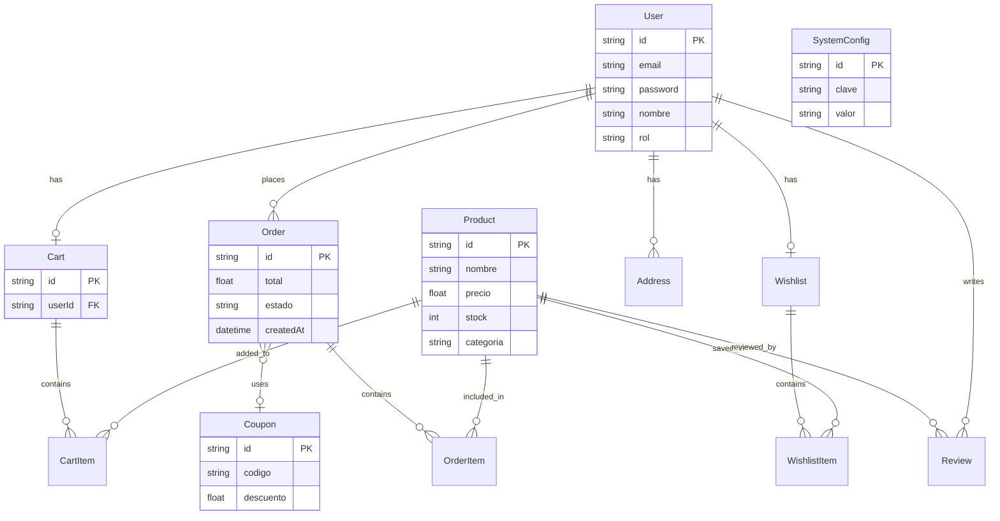

# Documentación del Sistema — E-Commerce Platform

## 1. Tecnologías Utilizadas

### Frontend
- **React 18+**: Biblioteca principal para la interfaz de usuario.
- **TypeScript**: Tipado estático para mayor robustez.
- **Vite**: Herramienta de construcción rápida y servidor de desarrollo.
- **Zustand**: Gestión de estado ligero y escalable.
- **Tailwind CSS**: Framework de utilidades para el diseño visual.
- **React Router v6**: Manejo de navegación y rutas protegidas.
- **React Hook Form + Zod**: Validación de formularios eficiente.
- **Axios**: Cliente HTTP para consumo de APIs.
- **Recharts**: Visualización de datos y estadísticas.
- **Lucide React**: Set de iconos modernos.

### Backend
- **Node.js (LTS)**: Entorno de ejecución para el servidor.
- **Express**: Framework web para la API REST.
- **TypeScript**: Lenguaje de desarrollo para el servidor.
- **Prisma ORM**: Mapeo objeto-relacional para interacción con la base de datos.
- **JWT (JSON Web Tokens)**: Autenticación y autorización segura.
- **Bcryptjs**: Encriptación de contraseñas.
- **Zod**: Validación de esquemas y datos de entrada.
- **PDFKit / Puppeteer**: Generación de reportes operativos y de gestión.

### Base de Datos
- **PostgreSQL**: Motor de base de datos relacional.

---

## 2. Arquitectura del Sistema

El sistema sigue una **Arquitectura en Capas Desacopladas**:

1.  **Capa de Presentación (Frontend SPA)**: Una aplicación React que se comunica con el backend exclusivamente mediante peticiones HTTP (REST).
2.  **Capa de Aplicación (API REST)**: Desarrollada en Express, implementa el patrón **Controller-Service-Repository**:
    -   **Routes**: Definen los puntos de entrada (endpoints).
    -   **Controllers**: Manejan la lógica de las peticiones HTTP y respuestas.
    -   **Services**: Contienen la lógica de negocio central.
    -   **Repositories**: Encapsulan el acceso a datos mediante Prisma.
3.  **Capa de Datos**: Base de datos PostgreSQL gestionada por Prisma, asegurando integridad referencial y auditoría básica.

---

## 3. Diagrama de Base de Datos



---

## 4. Flujo del Sistema

### Flujo de Usuario (Cliente)
1.  **Navegación**: El usuario explora el catálogo de productos (público).
2.  **Autenticación**: Para comprar, el usuario debe iniciar sesión o registrarse.
3.  **Carrito**: Agrega productos al carrito (persiste en la DB si está logueado).
4.  **Checkout**:
    -   Selecciona dirección de envío.
    -   Aplica cupones de descuento.
    -   Confirma la orden (se reduce el stock y se crea la orden).
5.  **Seguimiento**: El usuario puede ver su historial de órdenes y el estado de cada una.

### Flujo de Administración
1.  **Gestión de Inventario**: CRUD de productos y control de existencias.
2.  **Gestión de Órdenes**: Los administradores actualizan estados (Pagado, Enviado, etc.).
3.  **Análisis**: Visualización de KPIs y gráficas en el Dashboard.
4.  **Configuración**: Ajuste de parámetros del sistema y gestión de cupones.

---

## 5. Funciones Principales por Módulo

-   **Módulo de Catálogo**: Búsqueda avanzada, filtros por categoría y visualización de detalles del producto.
-   **Módulo de Carrito/Checkout**: Manejo de ítems, cálculo de totales, validación de stock en tiempo real y aplicación de descuentos.
-   **Módulo de Órdenes**: Generación de facturas PDF, historial de compras y gestión de estados de envío.
-   **Módulo de Inventario**: Alertas de stock bajo, gestión de proveedores y trazabilidad de movimientos.
-   **Módulo de Estadísticas**: Dashboard con métricas de ventas, productos más vendidos y comportamiento de usuarios.
-   **Módulo de Seguridad**: Control de acceso basado en roles (RBAC) para proteger rutas críticas.

---

## 6. Pasos de Instalación

### Requisitos Previos
- Node.js 20+ instalado.
- Instancia de PostgreSQL 16+ en ejecución.

### Configuración del Backend
1.  Navegar a la carpeta: `cd backend`.
2.  Instalar dependencias: `npm install`.
3.  Configurar variables de entorno:
    -   Copiar `.env.example` a `.env`.
    -   Configurar `DATABASE_URL` con tus credenciales de PostgreSQL.
4.  Generar el cliente de Prisma: `npx prisma generate`.
5.  Ejecutar migraciones y semilla:
    ```bash
    npx prisma migrate dev --name init
    npx prisma db seed
    ```
6.  Iniciar servidor: `npm run dev` (Corre en el puerto 4000).

### Configuración del Frontend
1.  Navegar a la carpeta: `cd frontend`.
2.  Instalar dependencias: `npm install`.
3.  Iniciar aplicación: `npm run dev` (Corre en el puerto 5173).

### Credenciales por Defecto
- **Admin**: `admin@ecommerce.com` / `Admin123!`
